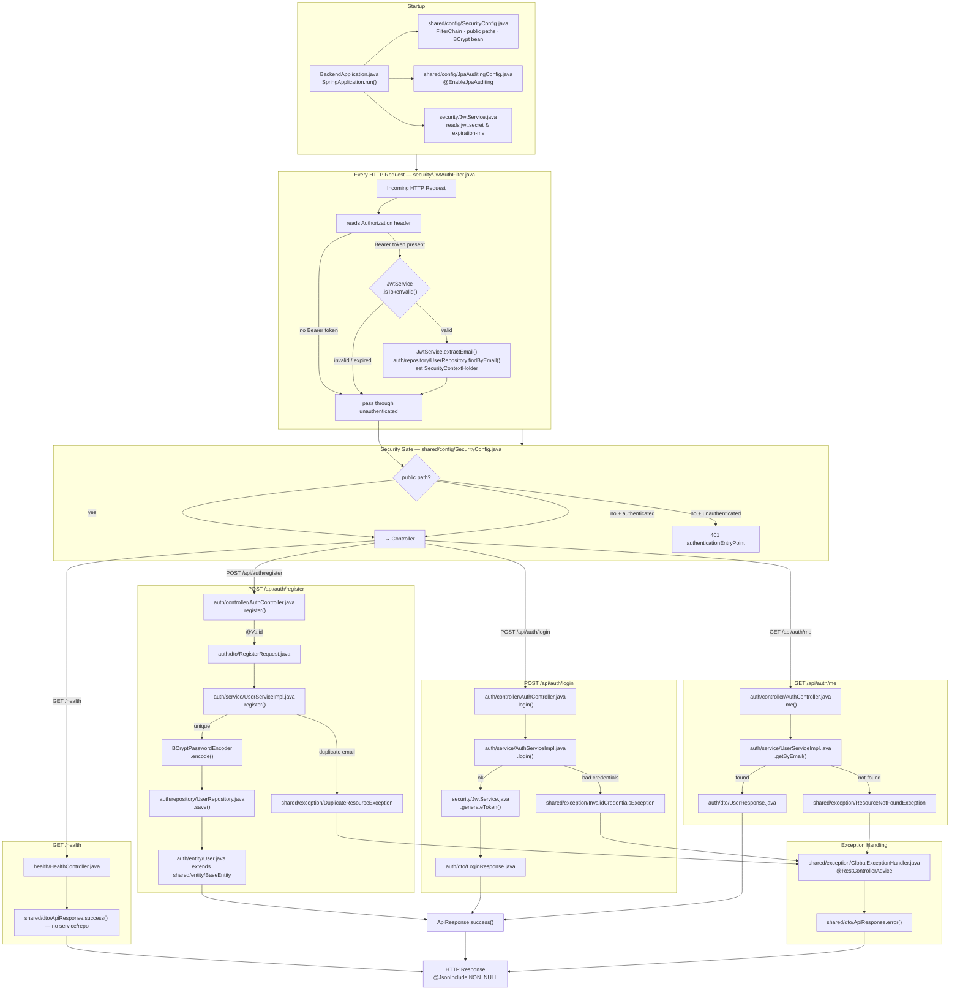

# Codebase Walkthrough — Auth + Health Slice

A trace of the request lifecycle through the current codebase, starting from the application
entry point.

## 1. Entry point — `BackendApplication.java`

`main()` calls `SpringApplication.run()`, which boots Spring Boot. `@SpringBootApplication`
triggers component scanning — Spring scans every class under `com.travelease.backend` for
annotations like `@RestController`, `@Service`, `@Repository`, `@Configuration`, and wires them
all into one dependency-injection container. Nothing else in the codebase is invoked manually —
everything happens because Spring found an annotation and built/wired the object for you.

## 2. What gets built at startup

Three `@Configuration` classes register infrastructure beans before any request can be handled:

- **`shared/config/JpaAuditingConfig.java`** — `@EnableJpaAuditing` turns on automatic
  `createdAt`/`updatedAt` stamping for entities.
- **`shared/config/SecurityConfig.java`** — builds the `SecurityFilterChain`: which paths are public
  (`register`, `login`, `health`, `h2-console`, `swagger-ui`, `v3/api-docs`), which require a JWT
  (everything else), and registers `JwtAuthFilter` to run on every request before Spring's normal
  auth filter.
- Spring Boot's own auto-configuration wires the H2 `DataSource`, Hibernate/JPA, and springdoc
  (Swagger).

`security/JwtService.java` is also instantiated here — its constructor reads
`app.jwt.secret`/`app.jwt.expiration-ms` from `application.properties` and builds the signing key
once.

## 3. Request flow: every request, before it reaches a controller

Every HTTP request passes through `JwtAuthFilter` (`security/JwtAuthFilter.java`) first, because
`shared/config/SecurityConfig.java` registered it with
`.addFilterBefore(jwtAuthFilter, UsernamePasswordAuthenticationFilter.class)`:

1. Reads the `Authorization` header. No `Bearer <token>` → does nothing, just passes the request
   through.
2. If there's a token, asks `JwtService.isTokenValid(token)`. If invalid/expired, passes through
   unauthenticated (the request will get rejected later if it hits a protected endpoint).
3. If valid, extracts the email from the token (`JwtService.extractEmail`), looks the user up via
   `auth/repository/UserRepository.findByEmail`, and sets `SecurityContextHolder`'s `Authentication`
   with that user's email as principal and `ROLE_<X>` as their authority.

After the filter, `SecurityConfig`'s rule decides whether to let the request through: public
paths (`register`, `login`, `health`, etc.) go through regardless; everything else requires that
`Authentication` to be non-null, otherwise it returns `401` via the custom
`authenticationEntryPoint`.

## 4. Tracing `POST /api/auth/register`

`AuthController.register()` does three things: validates `RegisterRequest` (the `@Valid` triggers
Jakarta Bean Validation — `@NotBlank`, `@Email`, `@Size`, `@Pattern` on the record's fields in
`auth/dto/RegisterRequest.java`), then delegates to `UserService.register()`, then wraps the result
in `ApiResponse.success(...)` with a `201`.

`UserServiceImpl.register()` checks for a duplicate email (throws `DuplicateResourceException` if
found), hashes the password with `PasswordEncoder` (the `BCryptPasswordEncoder` bean from
`shared/config/SecurityConfig.java`), always assigns `Role.ROLE_TRAVELER`, then calls
`UserRepository.save(user)`. `UserRepository` is a Spring Data JPA interface — Spring generates the
implementation at startup, translating `save()` into an `INSERT` against the `users` table in H2,
mapped from the `User` entity (`auth/entity/User.java`), which extends `BaseEntity`
(`shared/entity/BaseEntity.java`) for the auto-populated `id`/`createdAt`/`updatedAt`.

## 5. Tracing `POST /api/auth/login`

`AuthServiceImpl.login()` looks up the user by email, verifies the password with
`passwordEncoder.matches()` (compares the raw password against the stored BCrypt hash — never
decrypts, BCrypt is one-way), and if both checks pass, calls `JwtService.generateToken(email)` to
sign a JWT with the user's email as the subject and a 15-minute expiry (`app.jwt.expiration-ms`).
It returns a `LoginResponse(accessToken, user)`.

## 6. Tracing `GET /api/auth/me`

By the time this controller method runs, `JwtAuthFilter` has already validated the token and
populated `SecurityContextHolder`. Spring injects that as the `Authentication authentication`
parameter directly into `AuthController.me()` — `authentication.getName()` returns the email that
was set as the principal. The controller calls `UserService.getByEmail()`, which throws
`ResourceNotFoundException` if the user vanished (e.g. deleted after the token was issued),
otherwise maps the entity to a `UserResponse`.

## 7. Tracing `GET /health`

The simplest one — `HealthController.java` has no dependencies; it just returns
`ApiResponse.success(Map.of("status", "UP"), "Backend is healthy")` directly. No service, no
repository, no database hit.

## 8. How errors become consistent JSON

Any exception thrown from a service (`DuplicateResourceException`, `InvalidCredentialsException`,
`ResourceNotFoundException`) or from `@Valid` validation (`MethodArgumentNotValidException`)
bubbles up past the controller — Spring catches it and routes it to
`shared/exception/GlobalExceptionHandler.java`, a `@RestControllerAdvice` that maps each exception
type to the right HTTP status and builds an `ApiResponse.error(code, message)`.

## 9. The response envelope

Every successful or failed response is wrapped in `ApiResponse<T>` (`shared/dto/ApiResponse.java`) —
`@JsonInclude(NON_NULL)` means Jackson omits `error` on success and `data`/`message` on failure,
so the JSON stays clean instead of showing nulls.

That's the full request lifecycle for all four endpoints — entry point → Spring boot wiring →
security filter → controller → service → repository/JWT → entity/database → response envelope.

---

## 10. File-by-file flow diagram

